# Agents for Analysis Report Creation

A Plan-and-Execute agentic pipeline that autonomously researches topics using Statistics Canada publications and produces structured Markdown analysis reports. The agent breaks a research question into subtasks, retrieves data from an ingested document store, supplements with live DuckDuckGo web search, and synthesizes findings into a formatted report.

Built with Claude (Anthropic), LangGraph, FAISS, FastAPI, and Streamlit.

## Architecture



**How the pipeline works:**

1. **Plan** — Claude breaks the user's research topic into 3–6 concrete subtasks (e.g., "Search for rent trends in Canadian cities," "Compare construction investment across provinces").
2. **Execute** — A LangGraph react agent runs each subtask, choosing from three tools: the FAISS document retriever (ingested Stats Canada articles), DuckDuckGo web search (for supplementary context), and a Claude-powered summarizer (for condensing long passages).
3. **Synthesize** — Claude compiles all step results into a structured Markdown report with an Executive Summary, Key Findings, Analysis, and Conclusion.

## What This Project Demonstrates

- **Tool use**: The agent autonomously selects tools based on each subtask — retrieving from the document store first, falling back to web search, and summarizing when results are long.
- **Multi-step reasoning**: The planner decomposes complex research questions into a sequenced plan; the executor carries out each step and feeds results forward.
- **Structured output generation**: Final reports follow a consistent Markdown structure suitable for export or presentation.
- **Real-world data**: The knowledge base is built from actual Statistics Canada publications on Canadian housing, rent, construction, demographics, and co-residency trends.

## Data Sources

The FAISS vector store is populated from Statistics Canada publications. The default `urls.txt` includes:

| Article | Topic |
|---------|-------|
| Investment in building construction (Feb 2026) | Construction spending trends by province |
| Non-permanent residents in the homeownership market | Immigration and housing demand |
| Quarterly rent statistics (Q2–Q3 2025) | Rent price trends across Canadian cities |
| Adulting together: Parents and adult children who co-reside | Co-residency demographics |
| Measuring unmet housing need and housing instability | Housing need in households with roommates/extended family |
| Youth screen time and well-being (longitudinal study) | Screen time, mental health, physical activity |

## Sample Queries

These work well because they pull from multiple ingested articles, forcing the agent to plan across sources:

- "Write an analysis of Canada's housing affordability crisis using recent Statistics Canada data"
- "How are non-permanent residents affecting Canadian housing markets?"
- "What are the trends in rent prices and building construction investment in Canada?"
- "Analyze the relationship between housing costs and adult children co-residing with parents"
- "What does Statistics Canada data reveal about unmet housing need in Canadian households?"

## Getting Started

### Prerequisites

- Python 3.10+
- An Anthropic API key

### 1. Install dependencies

```bash
pip install -r requirements.txt
```

### 2. Set your API key

```bash
export ANTHROPIC_API_KEY="your-key-here"
```

### 3. Ingest documents into the vector store

```bash
python ingest.py --urls urls.txt
```

This scrapes Statistics Canada articles, chunks the text (1000 chars with 100 overlap), generates embeddings with HuggingFace `all-MiniLM-L6-v2`, and saves the FAISS index to `./faiss_index/`.

You can also ingest local `.txt` files:

```bash
python ingest.py --texts data/
```

### 4. Run the Streamlit frontend

```bash
streamlit run app.py
```

### 5. Or run the FastAPI backend

```bash
uvicorn api:app --reload --port 8000
```

API endpoints:

- `POST /api/report` — Generate a report synchronously
- `POST /api/report/async` — Start generation in background, returns a `task_id`
- `GET /api/report/{task_id}` — Poll for async task status
- `GET /api/health` — Health check

Interactive docs available at `http://localhost:8000/docs`.

### 6. Run tests

```bash
pytest tests/ -v
```

26 tests covering tools, agent pipeline, and API endpoints — all mocked, no API key required.

## Project Structure

```
agents-analysis-report/
├── config.py           # Centralized configuration (model, chunking, paths)
├── ingest.py           # Scrape URLs or read text files → FAISS index
├── tools.py            # Agent tools: doc retriever, summarizer, web search
├── agent.py            # Plan-and-Execute pipeline (plan → execute → synthesize)
├── api.py              # FastAPI backend (sync + async endpoints)
├── app.py              # Streamlit frontend with live progress display
├── urls.txt            # Statistics Canada URLs for ingestion
├── requirements.txt
├── pytest.ini          # Suppress LangChain deprecation warnings in tests
├── tests/
│   ├── test_tools.py   # 8 tests — retriever, summarizer, web search
│   ├── test_agent.py   # 9 tests — planner, synthesizer, full pipeline
│   └── test_api.py     # 9 tests — endpoints, validation, error handling
└── faiss_index/        # Generated vector store (gitignored)
```

## Tech Stack

| Component | Technology |
|-----------|-----------|
| LLM | Claude Sonnet (Anthropic) via `langchain-anthropic` |
| Agent framework | LangGraph `create_react_agent` |
| Web search | DuckDuckGo Search (no API key required) |
| Vector store | FAISS with HuggingFace `all-MiniLM-L6-v2` embeddings |
| Backend | FastAPI (sync + async with background threading) |
| Frontend | Streamlit |
| Testing | pytest with `unittest.mock` |

