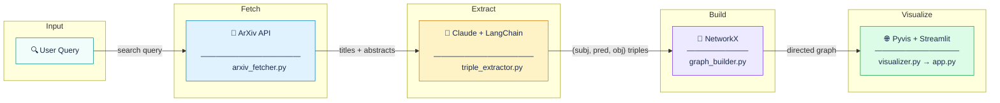
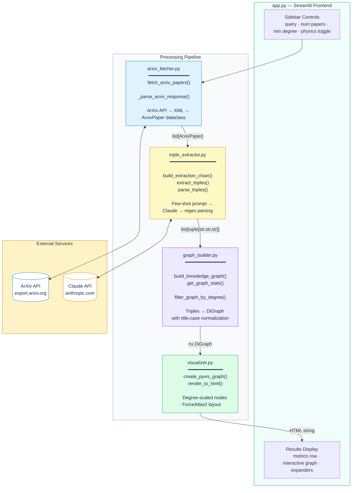

# arxiv-knowledge-graph

Extract entities and relationships from AI/ML research abstracts and visualize them as an interactive knowledge graph.

Built with Claude (Anthropic API), LangChain, NetworkX, Pyvis, and Streamlit.



## How it works

The application runs a four-stage pipeline:

1. **Fetch** research paper metadata (title, authors, abstract) from the ArXiv API based on a user query.
2. **Extract** knowledge triples (subject, predicate, object) from each abstract using Claude via a LangChain prompt template with few-shot examples.
3. **Build** a directed graph in NetworkX where nodes are entities (concepts, methods, datasets) and edges are labeled relationships.
4. **Visualize** the graph as an interactive network using Pyvis, embedded in a Streamlit app where users can pan, zoom, and explore connections.

For example, querying "transformer attention mechanism" might produce triples like `(Transformer, relies on, Self-Attention)` and `(BERT, is a, Language Representation Model)`, which then render as a clickable network showing how these concepts relate across papers.

## Project structure

```
arxiv-knowledge-graph/
  .env                          # API key (not committed)
  requirements.txt
  src/
    app.py                      # Streamlit frontend
    arxiv_fetcher.py            # ArXiv API integration
    triple_extractor.py         # Claude-powered entity/relation extraction
    graph_builder.py            # NetworkX graph construction + filtering
    visualizer.py               # Pyvis interactive visualization
    lib/                        # Vendored JS libraries for Pyvis rendering
      vis-9.1.2/
      tom-select/
      bindings/
  tests/
    test_arxiv_fetcher.py
    test_triple_extractor.py
    test_graph_builder.py
    test_visualizer.py
    test_integration.py
```

## Setup

**Prerequisites:** Python 3.10+ and an [Anthropic API key](https://console.anthropic.com/).

```bash
# Clone the repo
git clone https://github.com/sayleepradhan/arxiv-knowledge-graph.git
cd arxiv-knowledge-graph

# Create a virtual environment
python -m venv venv
source venv/bin/activate        # macOS/Linux
# venv\Scripts\activate         # Windows

# Install dependencies
pip install -r requirements.txt

# Add your API key
cp .env.example .env
# Edit .env and paste your ANTHROPIC_API_KEY
```

### requirements.txt

```
langchain>=0.3.0
langchain-anthropic>=0.3.0
langchain-core>=0.3.0
anthropic>=0.40.0
networkx>=3.2
pyvis>=0.3.2
streamlit>=1.40.0
requests>=2.31.0
python-dotenv>=1.0.0
pytest>=8.0.0
pytest-mock>=3.12.0
```

## Usage

### Streamlit app

```bash
cd src
streamlit run app.py
```

The app opens in your browser. Enter a search query (e.g., "graph neural networks" or "diffusion models"), choose how many papers to process, and click **Build Knowledge Graph**. The interactive visualization appears below with draggable, clickable nodes.

**Sidebar controls:**

- **ArXiv search query** - any topic; the ArXiv API handles free-text search
- **Number of papers** - how many abstracts to process (1 to 15)
- **Min connections to display** - filters out loosely connected nodes to reduce noise
- **Enable physics simulation** - toggles the force-directed layout

### What you can explore in the graph

- Hover over an edge to see the relationship label (e.g., "outperforms", "is based on", "proposes")
- Drag nodes to rearrange the layout
- Scroll to zoom in on dense clusters
- Check the "Most Connected Entities" section to see which concepts appear across multiple papers
- Expand "Papers processed" and "Extracted triples" for the raw data behind the graph

## Architecture



## How the extraction works

The triple extractor sends each abstract to Claude with a structured prompt that includes few-shot examples demonstrating the expected output format. The prompt instructs the model to identify entities (concepts, methods, datasets, metrics, researchers) and their relationships, then output them as delimiter-separated triples.

For an abstract about BERT, the model might return:

```
(BERT, is a, language representation model)<|>(BERT, uses, deep bidirectional representations)<|>(BERT, achieves state-of-the-art on, NLP benchmarks)
```

The `parse_triples` function then uses regex to extract each `(subject, predicate, object)` tuple, handling edge cases like extra whitespace, malformed segments, and empty responses. The graph builder normalizes entity names to title case so that "BERT", "bert", and "Bert" all resolve to a single node.

## Tests

Unit tests cover parsing logic, graph construction, and visualization. They run without an API key.

```bash
# Run unit tests
pytest tests/ -v --ignore=tests/test_integration.py

# Run integration tests (requires ANTHROPIC_API_KEY)
pytest tests/test_integration.py -v

# Run everything
pytest tests/ -v
```

Integration tests are gated behind `ANTHROPIC_API_KEY` being set, so they skip gracefully in CI environments without credentials.

## Tech stack

| Component | Purpose |
|-----------|---------|
| [Claude](https://docs.anthropic.com/) (Anthropic API) | LLM for entity and relationship extraction |
| [LangChain](https://python.langchain.com/) | Prompt templates and chain orchestration (LCEL syntax) |
| [NetworkX](https://networkx.org/) | Directed graph construction, filtering, and stats |
| [Pyvis](https://pyvis.readthedocs.io/) | Interactive HTML graph visualization |
| [Streamlit](https://streamlit.io/) | Web frontend with sidebar controls and embedded HTML |
| [ArXiv API](https://info.arxiv.org/help/api/) | Open access to research paper metadata |

## License

MIT